# 🍱<b> 정기배송형 도시락 판매 사이트 '든든'입니다.</b>
# ✅<b> 사이트 로고</b>
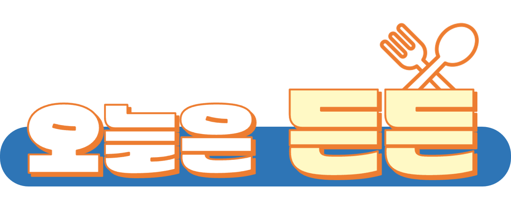
 

# <b>📖 프로젝트 소개</b>
> "든든"은 정기배송형 도시락 판매 사이트입니다. 

> 포스트 코로나와 1인 가구, 물가 증가로 건강식에 대한 수요와 정기배송의 관심도가 높아져 이를 충족시키기 위한 정기배송형 도시락 판매 사이트를 구현하고자 하였습니다.

# <b>📆 개발기간</b>
* 개발인원 : 7인 
* 2023.06.21.(수) ~ 07.12(수)

# <b> ⚙ 개발환경 </b>
* InteliJ, Eclipse(Spring Tool Suite 3)
* SourceTree
* ErdCloud
* Github
* Sql Developer
* Figma
* Apache Tomcat 8.5

# <b> 📋 사용기술</b>
* Java 11
* Spring MVC
* Spring Security
* MyBatis, Oracle 11g(AWS에 설치하여 공용으로 사용)
* HTML, CSS, JavaScript, Jquery, JSP, Bootstrap
* Kakao login api, Kakao chat api, javax.mail api, daum 주소 api, Iamport api, sweatalert2, kakao map api, summernote, Full calendar api 등 ~ 

# <b> 💡 핵심기능</b>
* 공통
  * 로그인, 회원가입, 아이디/비밀번호 찾기
* 관리자
  * 이용자관리
  * 이벤트관리
  * 쿠폰관리
  * 지점관리
  * 상품관리
  * 주문관리
  * 고객센터
  * 상품리뷰 답변
* 회원
  * 마이페이지 
    * 내정보수정
    * 주문조회
    * 식단관리
    * 찜목록 확인
    * 장바구니 확인
  * 상품주문 
  * 상품리뷰
  * 매장찾기
  * 고객센터
  
# <b>📁 ERD </b>
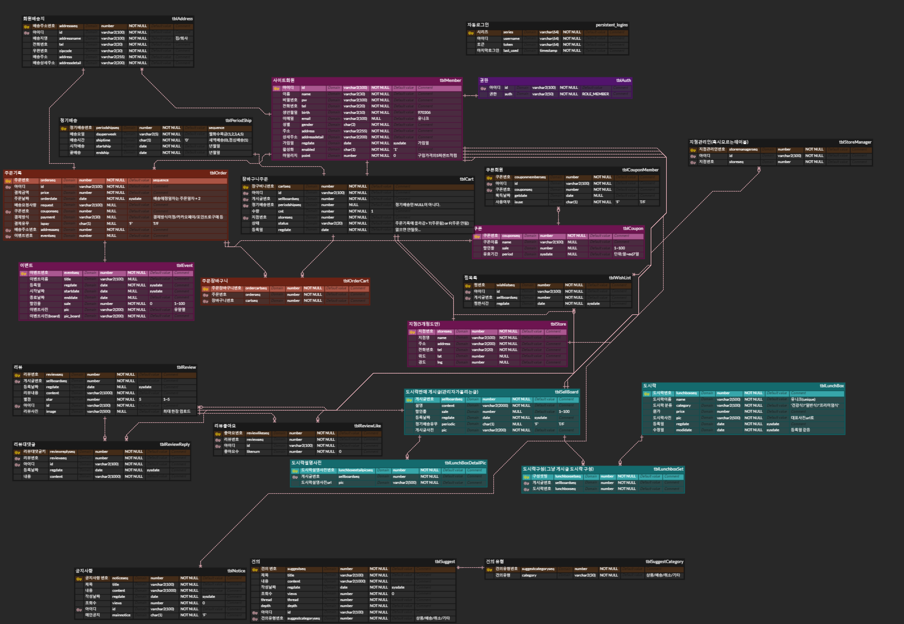

* [erdcloud링크](https://www.erdcloud.com/d/EDnxAoX9itLFDpveJ)
* 더미데이터는 자주 애용하는 도시락 판매 사이트에서 크롤링하여 사용

# <b>💻 실행화면 </b>
### 1️⃣ 메인페이지
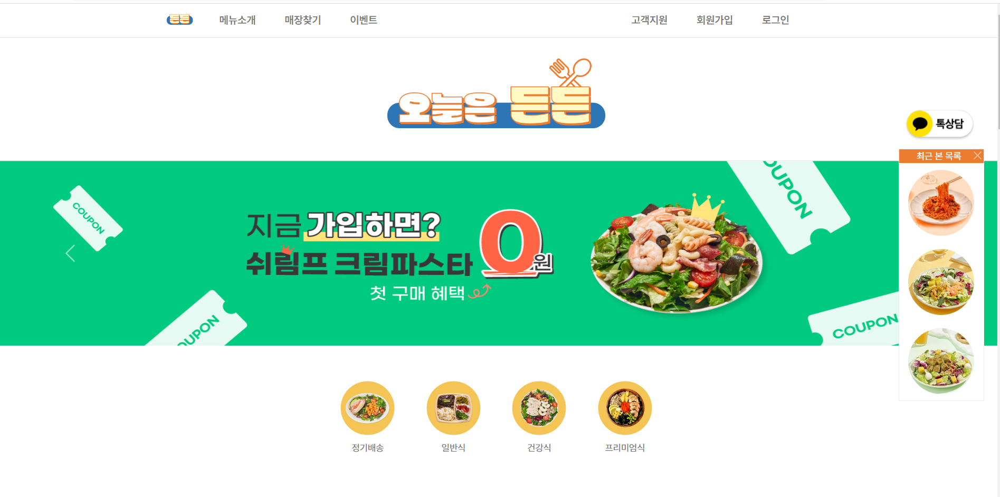
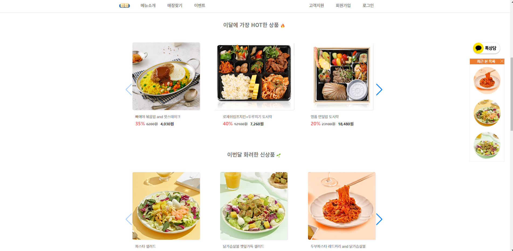
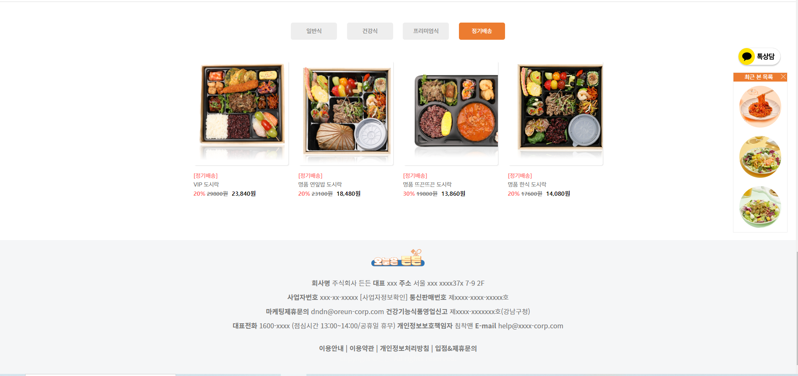

### 2️⃣ 메뉴소개
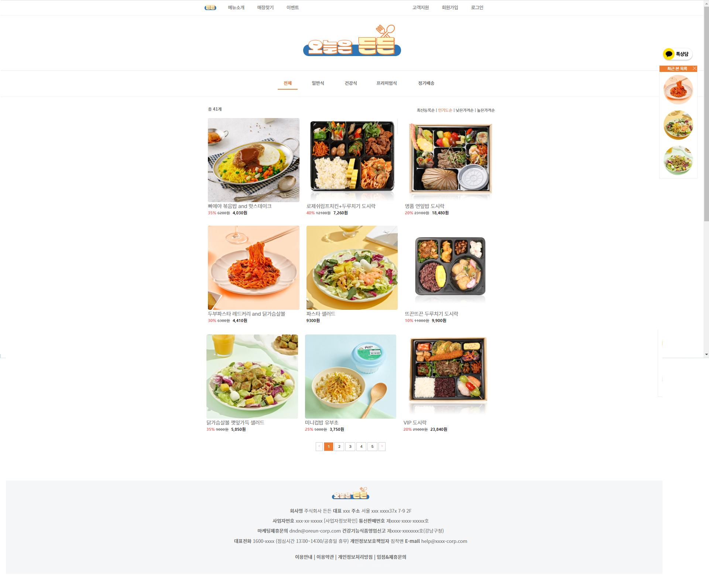

### 3️⃣ 도시락 상세페이지

### 4️⃣ 로그인(+소셜 로그인), 비밀번호 찾기
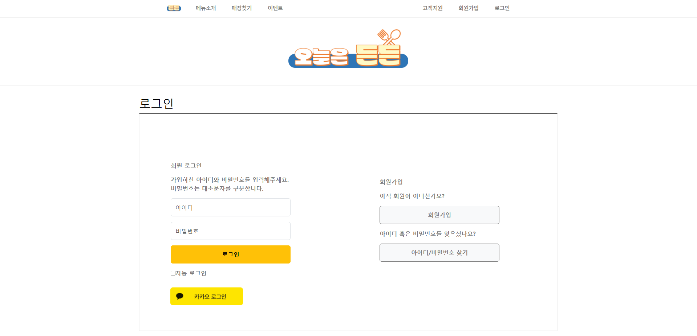
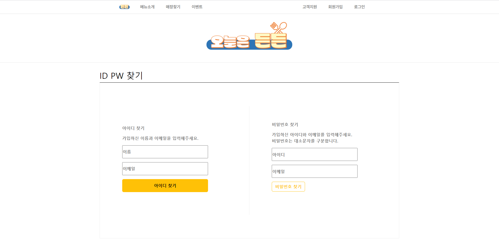

### 5️⃣ 결제, 장바구니
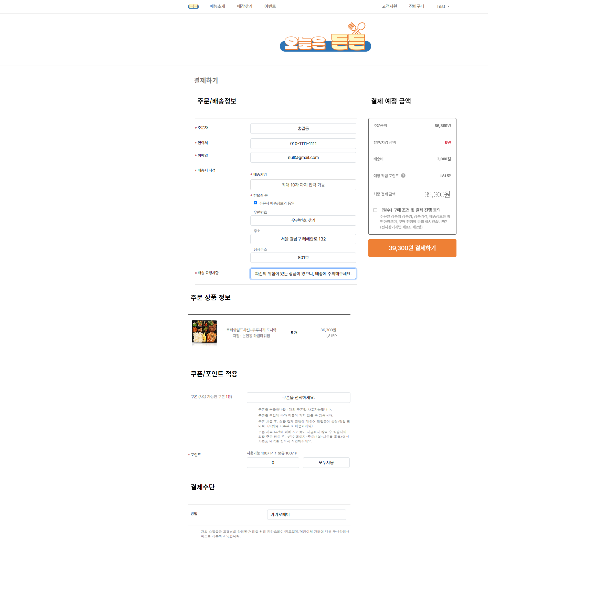
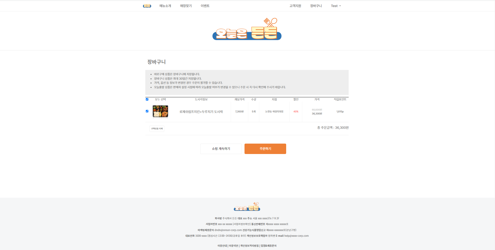

### 6️⃣ 고객센터
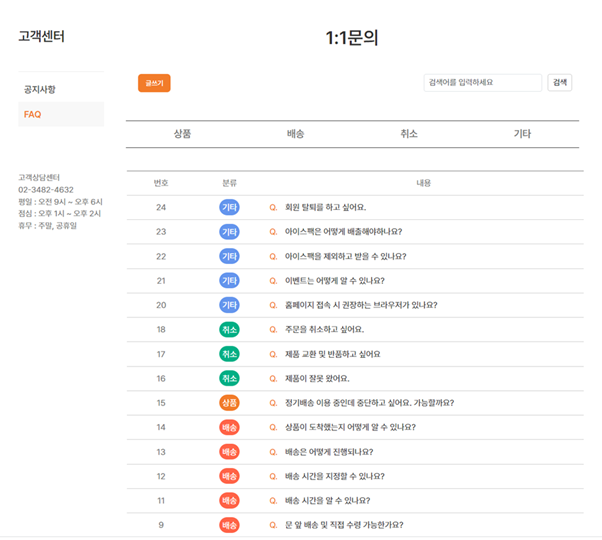

### 7️⃣ 관리자페이지
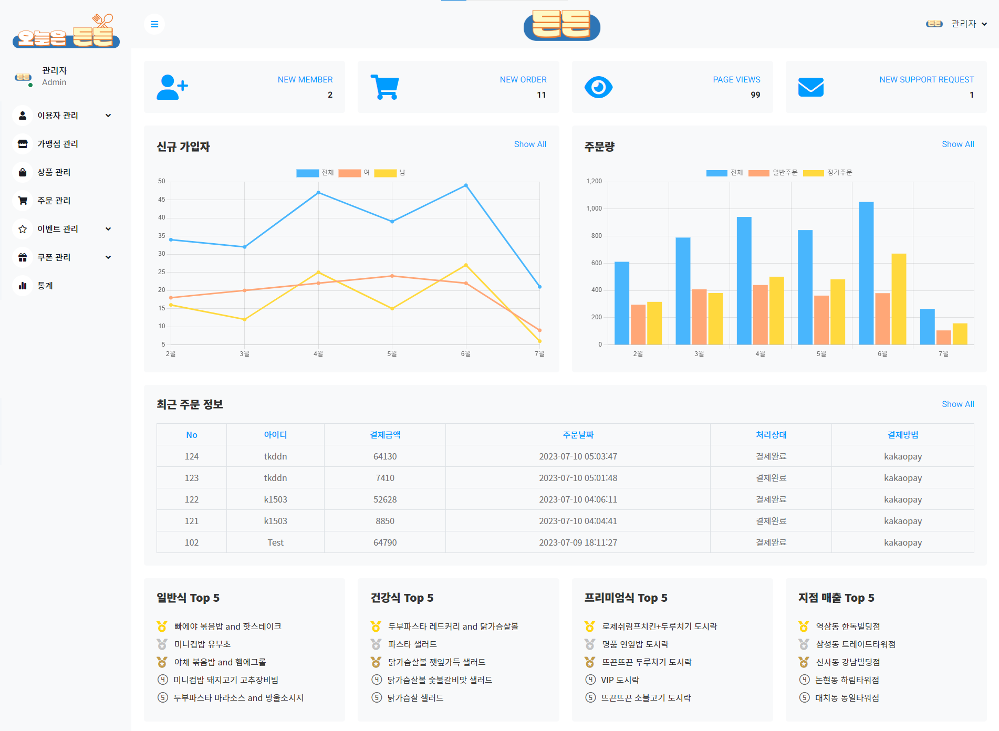

### 8️⃣ 마이페이지
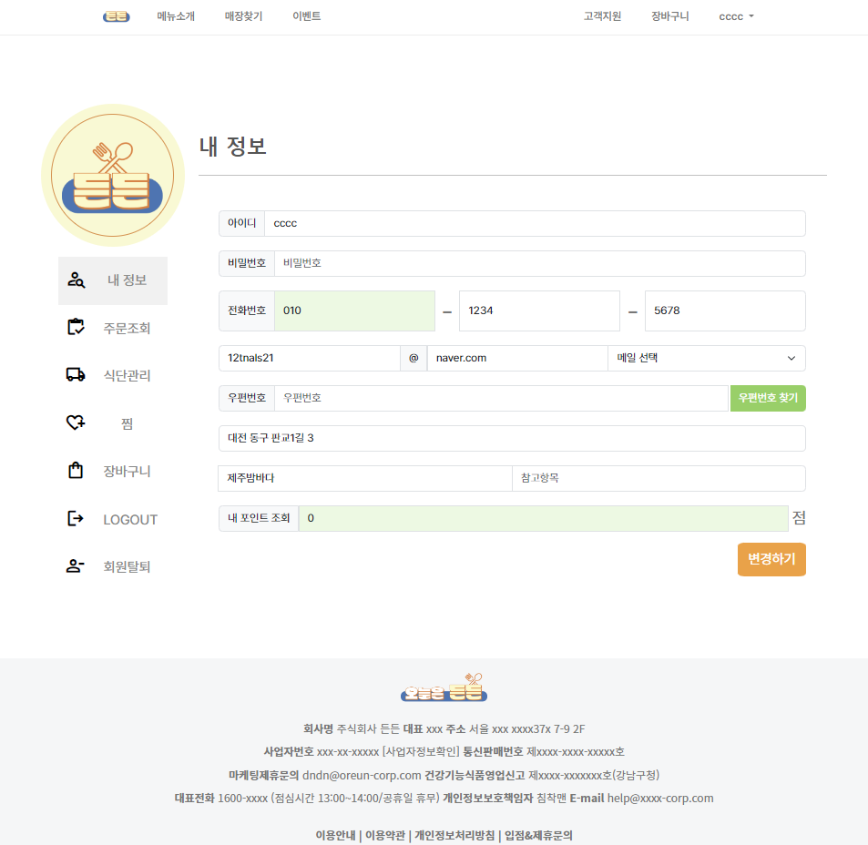
 
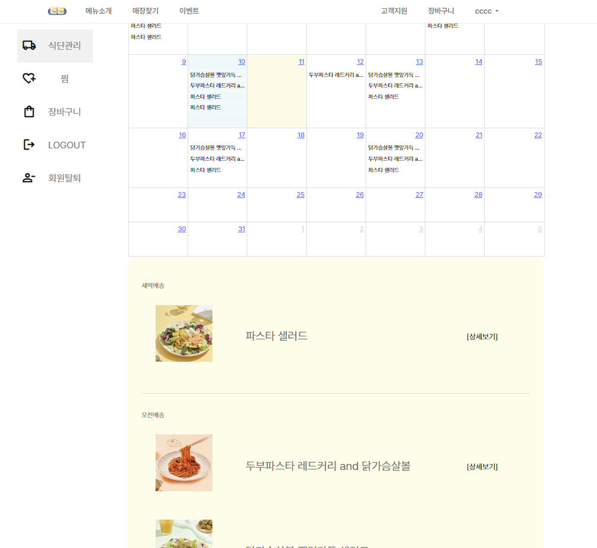

# <b>💻 시연영상</b>
* [유튜브링크](https://www.youtube.com/watch?v=5He5NMZhOV0)